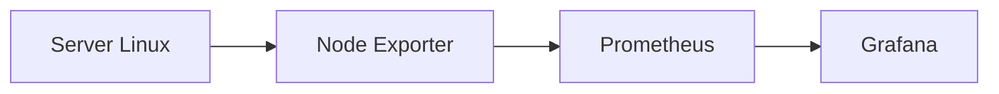

# Monitoring Server Menggunakan Grafana dan Prometheus

## Pendahuluan

Monitoring server merupakan salah satu aktivitas penting dalam administrasi sistem. Dengan monitoring, administrator dapat mengetahui kondisi server secara *real-time*, seperti penggunaan CPU, memori, penyimpanan, hingga lalu lintas jaringan.

Salah satu solusi monitoring yang banyak digunakan adalah kombinasi **Prometheus** dan **Grafana**. Prometheus bertugas mengumpulkan metrik dari server, sedangkan Grafana menampilkan metrik tersebut dalam bentuk dashboard yang mudah dipahami.

---

## Apa itu Prometheus?

Prometheus adalah aplikasi monitoring *open source* yang berfungsi mengumpulkan metrik dari server secara berkala. Data yang dikumpulkan dapat digunakan untuk memantau performa sistem maupun melakukan analisis historis.

---

## Apa itu Grafana?

Grafana adalah aplikasi visualisasi data yang digunakan untuk menampilkan metrik dari Prometheus dalam bentuk dashboard interaktif. Dengan grafik yang informatif, administrator dapat memantau kondisi server dengan lebih mudah.

---

## Cara Kerja Sederhana

Alur monitoring berjalan sebagai berikut:

1. **Node Exporter** membaca informasi dari server.
2. **Prometheus** mengambil metrik secara berkala.
3. Data disimpan sebagai *time series*.
4. **Grafana** mengambil data dari Prometheus.
5. Dashboard menampilkan kondisi server secara *real-time*.

---

## Mengapa Menggunakan Grafana dan Prometheus?

Beberapa kelebihan kombinasi keduanya antara lain:

- Open source dan gratis.
- Ringan serta mudah dikonfigurasi.
- Mendukung monitoring secara real-time.
- Dashboard interaktif dan mudah dipahami.
- Banyak digunakan pada lingkungan Linux, DevOps, dan Cloud Computing.

---

## Penutup

Grafana dan Prometheus merupakan kombinasi aplikasi monitoring yang populer karena mampu menyajikan informasi performa server secara cepat dan mudah dipahami. Pada artikel berikutnya akan dibahas proses instalasi serta konfigurasi Grafana dan Prometheus pada sistem operasi Debian.
